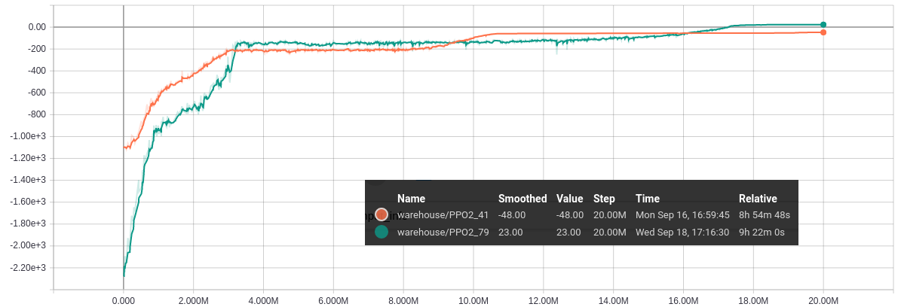

# Warehouse ordering system environment

Project contains an environment for simulating warehouse management system.

main.py cotains example solution for selected problem.

Below a tensorboard diagram with 20M steps long learning cycle.

 